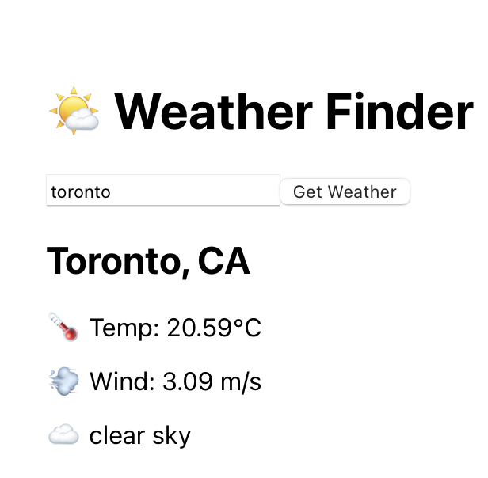

# 🌤️ Weather Finder

A simple and responsive **React + TypeScript** weather app that fetches real-time weather data from the **OpenWeatherMap API**.  
The app is fully containerized with **Docker**, making it production-ready and easy to deploy.

 

---

## 🚀 Features

- 🔎 Search for any city to get current weather
- 🌡️ Displays temperature, wind speed, and weather condition
- ⚛️ Built with React and TypeScript
- 🐳 Containerized using Docker
- 🔐 Uses API key via build-time environment variable

---

## 🧰 Tech Stack

- **React** (Frontend)
- **TypeScript** (Type safety)
- **Axios** (HTTP requests)
- **Docker** (Build and deployment)

---

## 📦 Installation (Local Docker Build)

### 1. Clone the Repository

```bash
git clone https://github.com/kelsierfin/weathergetter.git
cd WeatherGetter
